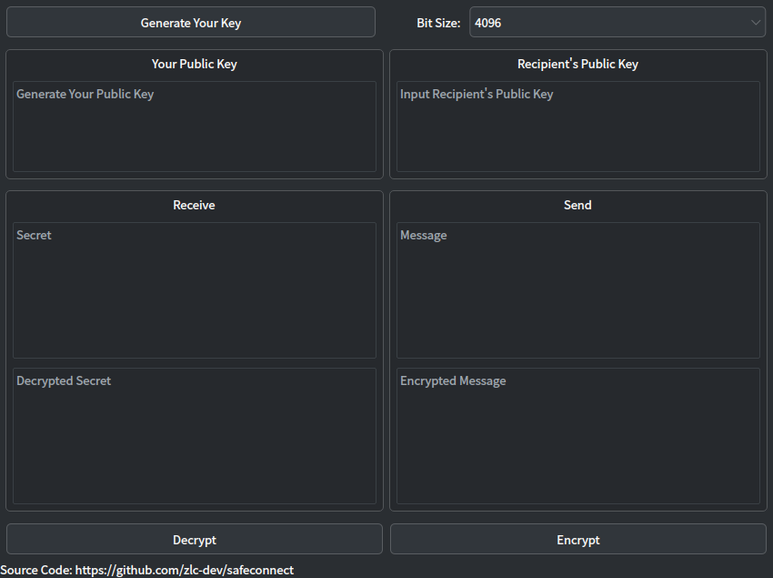

# Safe Connect Application

## Compile

Before compiling this software, you need to install the rust compilation toolchain and switch the compiler to the nightly version.
After finishing that, run `cargo build --release` in the root directory.

## Screenshot

